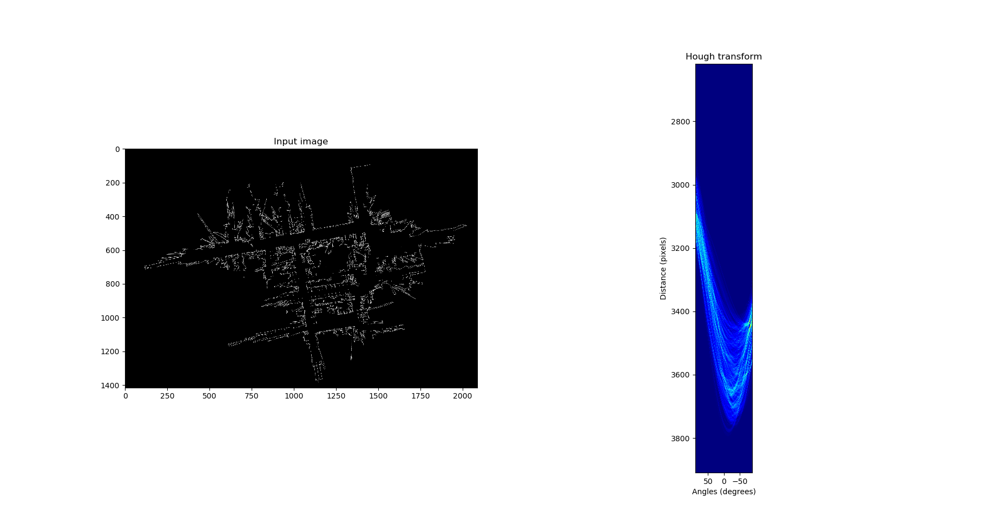
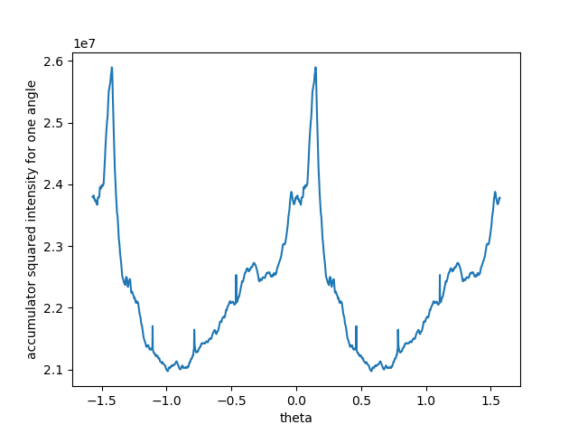

# Map Align Tool

A tool used for aligning occupancy grid maps to `x` and `y` axis. Uses the Hough transform algorithm to calculate the
angles of two dominating axes and returns the correction angle.



By squaring the hough space intensities and summing the column we get the intensity of each angle. Then By offsetting
the intensities by 90 degrees and adding them to the original intensities, we get positive interference on the two main
axes.




## Usage
```shell
map_align path_to_map_yaml
```
